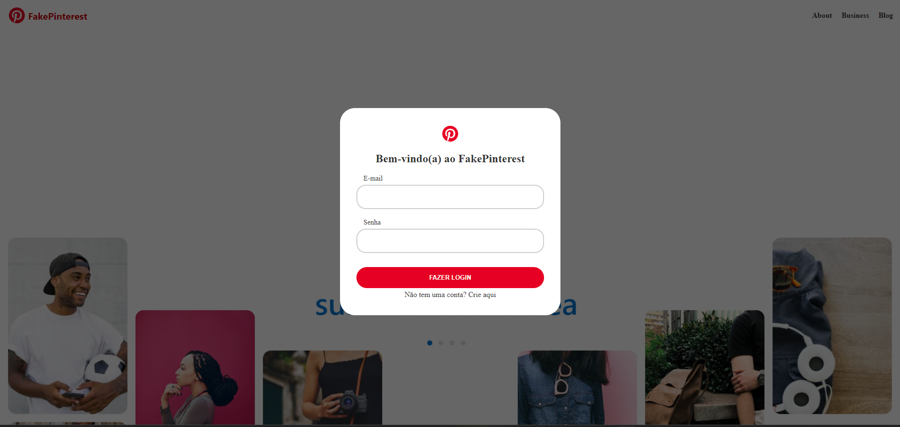

# FakePinterest

O projeto **FakePinterest** é uma recriação da página do Pinterest, permitindo aos usuários adicionar e compartilhar imagens. Desenvolvido em Python com Flask, utiliza SQLAlchemy para conectar-se a um banco de dados SQLite e Flask-Bcrypt para criptografar senhas.

As principais rotas incluem:

- **Homepage**: Processo de login e redirecionamento para criar uma conta.
- **Criar Conta**: Criação de conta com verificação de senha e e-mail.
- **Perfil**: Visualização do perfil do usuário, com opção de visualizar outros perfis através do feed.
- **Logout**: Possibilidade de sair da conta a qualquer momento.
- **Feed**: Página central onde as imagens compartilhadas pelos usuários são exibidas.
- **Visualizar**: Permite ver o perfil que compartilhou uma imagem e adicionar a imagem ao próprio perfil.
- **Adicionar**: Compartilhamento de imagens no perfil do usuário.

Para o visual da página, CSS e HTML foram utilizados. Este projeto foi desenvolvido com base no curso Python Impressionador da Hashtag Treinamentos, com implementações adicionais feitas por mim.
